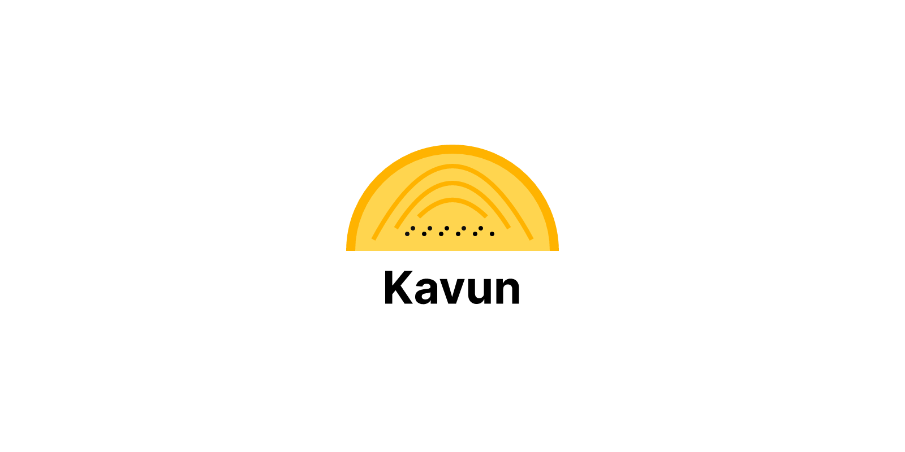

<!-- KAVUN -->



# Kavun🍈

Welcome to the **Kavun** project! It is a modern, opinionated, and production-ready starter for Spring Boot projects. It is designed to help developers get started with Spring Boot projects quickly and efficiently. The project includes a wide range of features and tools to help developers build robust and scalable applications. It is built using the latest technologies and best practices to ensure high performance, security, and maintainability.

## Meaning of Kavun

It is a melon in Turkish. It is a sweet and juicy fruit that is popular in Turkey and other countries. It is known for its refreshing taste and high nutritional value. The name **Kavun** is chosen to represent the project's goal of providing a fresh, modern, and healthy start for developers working on Spring Boot projects.

## Table of Contents

- [Kavun🍈](#kavun)
  - [Meaning of Kavun](#meaning-of-kavun)
  - [Table of Contents](#table-of-contents)
  - [Built With](#built-with)
  - [Key Features](#key-features)
  - [Development Guide](#development-guide)
    - [1. Prerequisites](#1-prerequisites)
    - [2. Installation](#2-installation)
    - [3. Project Setup](#3-project-setup)
    - [4. Environment Variables](#4-environment-variables)
    - [5. Accessing the Application](#5-accessing-the-application)
      - [H2 Database](#h2-database)
      - [Docker](#docker)
      - [Grafana](#grafana)
  - [Architecture](#architecture)
  - [Database Schema](#database-schema)
  - [Roadmap](#roadmap)
  - [Development Workflow](#development-workflow)
  - [Contributing](#contributing)
  - [Contact](#contact)

## Built With

- [Spring Boot 3.4.2](https://projects.spring.io/spring-boot/) - Inversion of Control Framework
- [Bootstrap 5](https://getbootstrap.com/docs/5.0/getting-started/introduction/) - HTML, CSS, and JavaScript framework
- [Thymeleaf](https://www.thymeleaf.org/) - Modern server-side Java template engine
- [Gradle](https://gradle.org/) - Dependency Management and Build Tool
- [Lombok](https://projectlombok.org/) - Automatically plugs into your editor and build tools, spicing up your java.
- [H2](http://www.h2database.com/) - In-Memory Database for development
- [Liquibase](https://liquibase.org/) - Rapidly manage database schema changes.
- [Spotless](https://github.com/diffplug/spotless/) - Spotless is a general-purpose formatting plugin.
- [Hibernate Envers](https://hibernate.org/orm/envers/) - Detailed Auditing of CRUD operations.
- [Spring Security](https://docs.spring.io/spring-boot/docs/2.6.7/reference/htmlsingle/#boot-features-security)
- [Java Mail Sender](https://docs.spring.io/spring-boot/docs/2.6.7/reference/htmlsingle/#boot-features-email)
- [Spring Configuration Processor](https://docs.spring.io/spring-boot/docs/2.6.7/reference/htmlsingle/#configuration-metadata-annotation-processor)
- [Rest Repositories](https://docs.spring.io/spring-boot/docs/2.6.7/reference/htmlsingle/#howto-use-exposing-spring-data-repositories-rest-endpoint)
- [Spring Boot Actuator](https://docs.spring.io/spring-boot/docs/2.6.7/reference/htmlsingle/#production-ready)
- [Spring Data JPA](https://docs.spring.io/spring-boot/docs/2.6.7/reference/htmlsingle/#boot-features-jpa-and-spring-data)
- [Validation](https://docs.spring.io/spring-boot/docs/2.6.7/reference/htmlsingle/#boot-features-validation)
- [Spring Boot DevTools](https://docs.spring.io/spring-boot/docs/2.6.7/reference/htmlsingle/#using-boot-devtools)
- [Spring Data Jpa DataTables](https://github.com/darrachequesne/spring-data-jpa-datatables)
- [Test Containers](https://java.testcontainers.org/)
- [clamAV](https://www.clamav.net/) - Open Source Antivirus Engine

## Key Features

- [Form and Rest Api Authentication based](docs/AUTHENTICATION.MD)
- [JWT Access and Refresh Tokens Support](docs/AUTHENTICATION.MD)
- [DataTables with Spring Data JPA](docs/DATATABLES.md)
- [OpenApi3 Swagger](docs/SWAGGER.md)
- [Form Validation](https://formvalidation.io/)
- [Last Successful Login](docs/AUTHENTICATION.MD)
- [Bruteforce Attack Prevention using Failed Login Attempts](docs/AUTHENTICATION.MD)
- [Unit and Integration Tests](docs/TESTS.md)
- [API Login Controller](docs/API_LOGIN_CONTROLLER.MD)
- [Advanced CORS Configuration](docs/CORS.md)
- [Fully Covered Equals, HashCode, ToString Testing](docs/TESTS.md#equals-hashcode-and-tostring)
- [Production Ready Folder Structure](README.md#architecture)
- [Authentication and Authorization with JWT](docs/AUTHENTICATION.MD)
- [Security Configuration Without WebSecurityConfigurerAdapter](https://spring.io/blog/2022/02/21/spring-security-without-the-websecurityconfigureradapter#ldap-authentication)
- **clamAV** Integration for File Scanning
- **Dynamic Role and Permission Management**


## Development Guide

### 1. Prerequisites

- [Java 21](https://www.oracle.com/java/technologies/javase-jdk21-downloads.html)
- [Gradle](https://gradle.org/install/)
- [Lombok](https://projectlombok.org/setup/overview)
- [Docker](https://docs.docker.com/get-docker/)
- [Docker Compose](https://docs.docker.com/compose/install/)
- [IntelliJ IDEA (Optional)](https://www.jetbrains.com/idea/download/)
- [Postman](https://www.postman.com/downloads/)
- [Git](https://git-scm.com/downloads)

> You can use any IDE of your choice. However, **VSCode** is recommended for this project.
> Before running the project, make sure the correct Java version is installed. You can check the Java version using the following command:

```bash
java -version
```

### 2. Installation

```bash
# Move to your workspace
cd <your-workspace>

# Clone this project into your workspace
git clone <repository-url>

# Move to the project root directory
cd backend

# Open the project in your favorite IDE
code . # For Visual Studio Code
idea . # For IntelliJ IDEA
```

### 3. Project Setup

```bash
# Start required services using Docker Compose
docker-compose up -d

# Run the application using Gradle (Windows / Linux / MacOS)
./gradlew bootRun

# Access the application on http://localhost:8080/
curl http://localhost:8080/
```

- Alternatively, you can use the following commands for project setup:

```bash
# Run the application
./gradlew bootRun

# Run unit tests
./gradlew test

# Run integration tests
./gradlew integrationTest

# Run all tests
./gradlew testAll

# Rebuild the project
./gradlew clean build

# Run the project continuously (Hot Reload)
./gradlew bootRun --continuous --quiet
./gradlew bootRun -t

# Refresh Gradle Project (If you see "The import XXX cannot be resolved" error)
./gradlew --refresh-dependencies

# Run owasp dependency check
./gradlew dependencyCheckAnalyze --info

# When you add a new dependency, run the following command to refresh the dependencies
./gradlew build --refresh-dependencies

# Refresh dependencies
./gradlew clean build --refresh-dependencies

# Refresh dependencies without tests
./gradlew clean build --refresh-dependencies -x test -x integrationTest
```

- **Note**: Before running the project, make sure to all the dependencies are installed and the project and connected to the databases.

### 4. Environment Variables

The following environment variables can be customized as necessary:

```bash
# Default Application Properties:
ADMIN_USERNAME=admin
ADMIN_PASSWORD=password
ENCRYPTION_SECRET_SALT=salt
ENCRYPTION_SECRET_PASSWORD=password
JWT_SECRET=salt
SPRING_PROFILES_ACTIVE=dev
ACCESS_TOKEN_EXPIRATION_IN_MINUTES=60 # Medium-lived tokens

# Default AWS S3 Properties:
AWS_REGION=us-east-1
AWS_ACCESS_KEY_ID=EXAMPLEACCESSKEYID
AWS_SECRET_ACCESS_KEY=EXAMPLESECRETACCESSKEY
AWS_S3_BUCKET_NAME=kavun

# Email Properties:
EMAIL_PROTOCOL=smtp
EMAIL_HOST=smtp.gmail.com
EMAIL_PORT=587
EMAIL_USERNAME=username
EMAIL_PASSWORD=password # If using gmail, this must be a 2 step verification enabled app password
```

- The profiles defined in the application are **development**, **docker**, **test**, and **production**.
- By default, the application runs with the **development** profile.

### 5. Accessing the Application

- Access the application on [http://localhost:8080/](http://localhost:8080/)
- Access the H2 Database on [http://localhost:8080/console](http://localhost:8080/console)
- Access the Swagger UI on [http://localhost:8080/swagger-ui/index.html](http://localhost:8080/swagger-ui/index.html)
- Access the Actuator Health on [http://localhost:8080/actuator/health](http://localhost:8080/actuator/health)
- Access the Actuator Prometheus on [http://localhost:8080/actuator/prometheus](http://localhost:8080/actuator/prometheus)
- Access the Grafana Dashboard on [http://localhost:3000/](http://localhost:3000/)
- Access the Prometheus Dashboard on [http://localhost:9090/](http://localhost:9090/)

#### H2 Database

If you are not using **DBeaver** or any other database client, you can access the **H2** database using the following steps:

```bash
# Open your web browser and go to http://localhost:8080/console

# The H2 database can be accessed using the following credentials:
- Saved Settings: Generic PostgreSQL
- Driver Class: Generic PostgreSQL
- JDBC URL: jdbc:postgresql://localhost:5432/kavun
- User Name: postgres
- Password: postgres

# Click on the Connect button to access the database.
```

> This configuration is used to connect to the H2 database. You can access .properties file to change the database configuration.
> The H2 database is only used for development and testing purposes. For production, the application uses the PostgreSQL database.

#### Docker

The application can be run on Docker using the following steps:

```bash
# Build the Docker image
docker build -t kavun-backend .

# Run the Docker container
docker-compose up -d
docker run -d -p 8080:8080 --name kavun-backend-container kavun-backend # If not using docker-compose

# Stop the Docker container
docker-compose down
docker stop kavun-backend-container && docker rm kavun-backend-container # If not using docker-compose

# Remove the Docker image
docker-compose down --rmi all
docker rmi kavun-backend # Be sure to stop and remove the container before removing the image

# Delete the Postgres data volume
docker volume rm <volume-name>
```

#### Grafana

The application uses **Grafana** for monitoring and visualization.

```bash
# Access Grafana Dashboard on http://localhost:3000/

# Default Grafana Credentials:
- Username: admin
- Password: admin
```

## Architecture

The project is structured in a layered architecture with the following layers:

```bash
.
├── config                            # Can hold project level configurations like pmd, checkstyle, etc.
├── docs                              # Holds project documentations. Markdown sections, etc.
│   └── images
├── libs                              # Holds special libraries used by the application.
│   └── newrelic
└── src
    ├── integrationTest               # Integration test suites separated from unit tests.
    │   ├── java
    │   │   └── com
    │   │       └── kavun
    │   │           ├── backend
    │   │           ├── task
    │   │           └── web
    │   └── resources
    ├── main
    │   ├── java
    │   │   └── com
    │   │       └── kavun
    │   │           ├── annotation     # All custom annotations used in the application
    │   │           ├── backend        # Business Logic and Data Access implementation
    │   │           ├── config         # Configuration classes and properties
    │   │           ├── constant       # Constants used in the application
    │   │           ├── enums          # Enums used in the application
    │   │           ├── exception      # Custom exceptions used in the application
    │   │           ├── shared         # Resources like dto, utils, etc. used in the application
    │   │           ├── task           # Scheduled tasks and cron jobs used in the application
    │   │           └── web            # Web layer implementation
    │   ├── resources
    │   │   ├── i18n                   # I18n property files, comes with 'en', 'fr', 'es' and 'zn_CN'
    │   │   ├── static
    │   │   │   ├── css
    │   │   │   ├── fonts
    │   │   │   ├── images
    │   │   │   └── js
    │   │   │       └── form-validation
    │   │   └── templates
    │   │       ├── common
    │   │       │   └── email
    │   │       ├── email
    │   │       ├── error
    │   │       └── user
    │   └── scripts                     # Scripts used in the application as part of docker build, etc.
    └── test
        ├── java
        │   └── com
        │       └── kavun
        │           ├── backend
        │           ├── config
        │           ├── shared
        │           └── web
        └── resources
```

## Database Schema


> **Note**: In Permission entity, the entityId field represents the ID of either a Role or a User, depending on the EntityType. This design allows for flexible permission assignments, enabling both role-based and user-specific permissions within the system.

## Roadmap

Please refer to the [Roadmap](docs/ROADMAP.md) for the project roadmap and future plans.

## Development Workflow

In the **Kavun** project, we follow a structured development workflow to ensure efficient collaboration and code management. This workflow includes the following key components: branching strategy, versioning, and commit message conventions. By following these guidelines, we aim to maintain a clean and organized codebase that is easy to manage and contribute to. For more information, please refer to the [Development Workflow](docs/DEVELOPMENT_WORKFLOW.md) document.

## Contributing

Please read [CONTRIBUTING.md](https://gist.github.com/PurpleBooth/b24679402957c63ec426)
for details on our code of conduct, and the process for submitting pull requests to us.

## Contact

Thanks to the following people who have contributed to this project:

- [Yunus Emre Alpu](https://www.linkedin.com/in/yunus-emre-alpu-5b1496151/) - Creator and Maintainer
