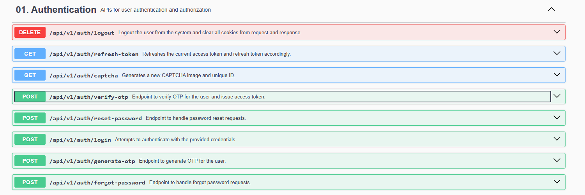
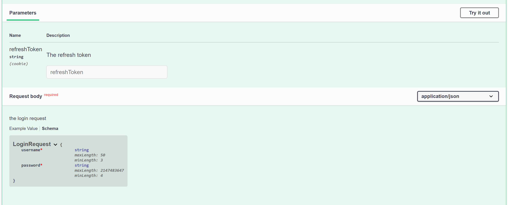
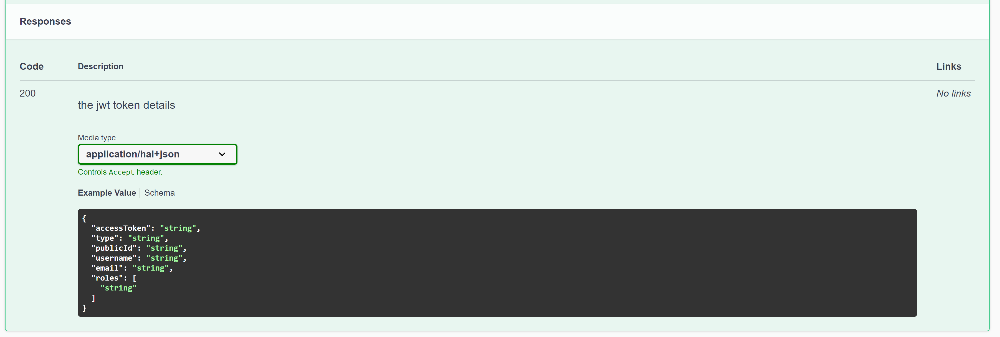
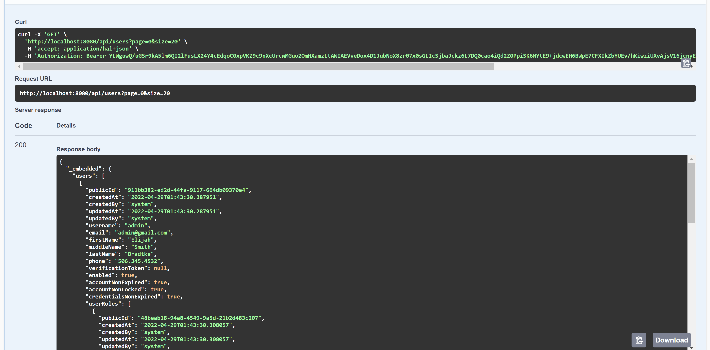
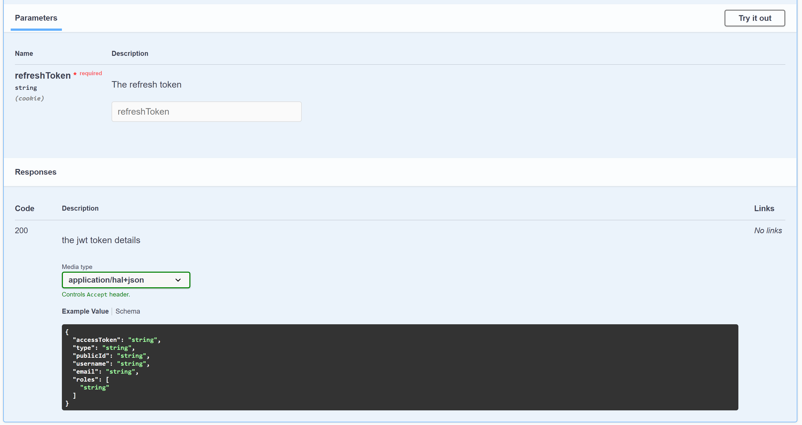
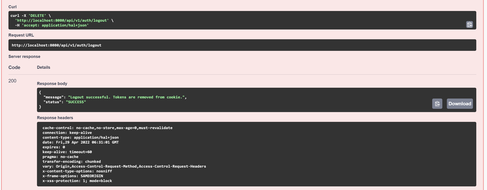

# API Authentication Controller

The API Authentication Controller is used to authenticate users, refresh expired tokens and logout.
The endpoints are not secured and are open to all users.

The base URL for the API Authentication Controller is:

```bash
/api/v1/auth
```



## Configuration

The authentication controller supports optional security features that can be enabled via environment variables:

### Captcha Protection

Captcha verification can be enabled to protect against automated login attempts:

```properties
login.captcha.enabled=${LOGIN_CAPTCHA_ENABLED:false}
```

**Default: `false` (Captcha is disabled)**

When `false` (default):
- Captcha validation is skipped completely
- `/api/v1/auth/captcha` endpoint is still available but not required
- `captchaId` and `captchaText` fields in login request are ignored

When `true`:
- A captcha **must** be requested from `/api/v1/auth/captcha` before login
- Login requests **must** include valid `captchaId` and `captchaText` fields
- Rate limiting applies: 5 captcha requests per minute per IP
- Captchas expire after 5 minutes
- Invalid or missing captcha will reject the login attempt

**Captcha Endpoint:**
```bash
GET: /api/v1/auth/captcha
```

Response:
```json
{
  "imageBase64": "data:image/png;base64,...",
  "captchaId": "uuid-string"
}
```

### OTP (One-Time Password)

Two-factor authentication via OTP can be enabled:

```properties
login.otp.enabled=${LOGIN_OTP_ENABLED:false}
```

**Default: `false` (OTP is disabled)**

When `false` (default):
- OTP verification is skipped completely
- Login returns JWT token directly after successful credential validation
- Two-factor authentication is not required

When `true`:
- Login does **not** return JWT token immediately
- An OTP code is sent to user's email or phone (based on user preference)
- Login returns `{ id, target }` session info
- User **must** call `/api/v1/auth/verify-otp` with the OTP code to complete authentication
- Only after OTP verification, JWT token is returned

## Authentication Flow

The authentication flow varies based on which security features are enabled:

### Flow 1: Basic Authentication (No Captcha, No OTP) ✅ DEFAULT

**Configuration:**
```properties
login.captcha.enabled=false  # Default
login.otp.enabled=false      # Default
```

**Flow:**
```
POST /api/v1/auth/login
  → username + password
  → Returns: JWT accessToken + refreshToken (cookie)
```

This is the **default behavior** when no environment variables are set.

### Flow 2: With Captcha Only

**Configuration:**
```properties
login.captcha.enabled=true   # Must be set
login.otp.enabled=false      # Default
```

**Flow:**
```
1. GET /api/v1/auth/captcha
   → Returns: { imageBase64, captchaId }

2. POST /api/v1/auth/login
   → username + password + captchaId + captchaText
   → Returns: JWT accessToken + refreshToken (cookie)
```

### Flow 3: With OTP Only

**Configuration:**
```properties
login.captcha.enabled=false  # Default
login.otp.enabled=true       # Must be set
```

**Flow:**
```
1. POST /api/v1/auth/login
   → username + password
   → Returns: { id, target } (OTP session info)

2. POST /api/v1/auth/verify-otp
   → id + target + code (6-digit OTP)
   → Returns: JWT accessToken + refreshToken (cookie)
```

### Flow 4: With Both Captcha and OTP (Maximum Security)

**Configuration:**
```properties
login.captcha.enabled=true   # Must be set
login.otp.enabled=true       # Must be set
```

**Flow:**
```
1. GET /api/v1/auth/captcha
   → Returns: { imageBase64, captchaId }

2. POST /api/v1/auth/login
   → username + password + captchaId + captchaText
   → Returns: { id, target } (OTP session info)

3. POST /api/v1/auth/verify-otp
   → id + target + code (6-digit OTP)
   → Returns: JWT accessToken + refreshToken (cookie)
```

**Important Notes:**
- **Both features are disabled by default** - Basic authentication (Flow 1) is used unless explicitly enabled
- Features can be enabled independently or together
- `target` is the user's email or phone number depending on their OTP delivery preference
- `id` is the OTP session identifier returned from the login endpoint
- OTP codes expire after a configured time period (typically 5 minutes)
- Failed OTP attempts are limited to prevent brute force attacks
- To enable features, set environment variables: `LOGIN_CAPTCHA_ENABLED=true` and/or `LOGIN_OTP_ENABLED=true`

---

## Login Endpoint

Attempts to authenticate with the provided credentials. If successful, a JWT token is returned with
some user details.

A refresh token is generated and returned as a cookie.

The URL for the login endpoint is:

```bash
POST: /api/v1/auth/login
```



 ```json
{
  "username": "admin",
  "password": "password",
  "captchaText": "Ab3Xy",
  "captchaId": "550e8400-e29b-41d4-a716-446655440000"
}
```

**Note:** The `captchaText` and `captchaId` fields are **optional** by default but become **required** when `login.captcha.enabled=true`. Request a captcha from `/api/v1/auth/captcha` endpoint before login when captcha is enabled.

Takes the username and password of a user as json then generates a JWT response object.
A new refreshToken is generated and returned as a cookie.

When a valid refreshToken is specified, the provided refreshToken will be used instead of generating
a new one.

**Response varies based on OTP configuration:**

1. When `login.otp.enabled=false` (default):

```json
{
  "accessToken": "eyJhbGciOiJIUzI1NiIsInR5cCI6IkpXVCJ9...",
  "expiresIn": 3600,
  "publicId": "uuid-string"
}
```

2. When `login.otp.enabled=true`:

```json
{
  "id": 123,
  "target": "user@example.com", # SMS or EMAIL
  "code": "123456" # Only included for testing purposes, not sent in production
}
```

**After receiving this response, proceed to verify-otp endpoint with the OTP code sent to the target.**



**Response Fields:**

- `accessToken`: JWT token to be passed with requests to access protected endpoints (only when OTP is disabled)
- `publicId`: User identifier for all requests (only when OTP is disabled)
- `id`: OTP session identifier (only when OTP is enabled)
- `target`: Email or phone where OTP was sent (only when OTP is enabled)

**Note:** Request to retrieve a user object does not include the database id. PublicId must be used instead.



## Verify OTP Endpoint

Verifies the OTP code and completes the authentication process when OTP is enabled.

The URL for the verify-otp endpoint is:

```bash
POST: /api/v1/auth/verify-otp
```

**Request Body:**
```json
{
  "id": 123,
  "target": "user@example.com",
  "code": "123456"
}
```

**Fields:**
- `id`: OTP session ID returned from the login endpoint
- `target`: Email or phone number where OTP was sent (returned from login)
- `code`: 6-digit OTP code received via email or SMS

**Response:**
```json
{
  "accessToken": "eyJhbGciOiJIUzI1NiIsInR5cCI6IkpXVCJ9...",
  "expiresIn": 3600,
  "publicId": "uuid-string"
}
```

**Error Responses:**
- `400 Bad Request`: Invalid OTP code, expired OTP, or maximum attempts exceeded
- `404 Not Found`: User not found for the given target
- `500 Internal Server Error`: OTP verification system error

## Refresh Endpoint

Refreshes the current access token by creating a new access token when given a valid refreshToken.

The URL for the refresh endpoint is:

```bash
GET: /api/v1/auth/refresh
```



## Logout Endpoint

Logs out the current user by invalidating the current refresh token. This is done by returning an
empty refreshToken via cookie.
Logout the user from the system and clear all cookies.

The URL for the logout endpoint is:

```bash
DELETE: /api/v1/auth/logout
```


