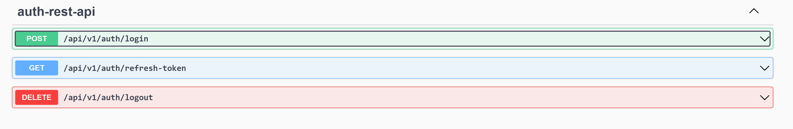

# API Authentication Controller

The API Authentication Controller is used to authenticate users, refresh expired tokens and logout.
The endpoints are not secured and are open to all users.

The base URL for the API Authentication Controller is:

```bash
/api/v1/auth
```



## Login Endpoint

Attempts to authenticate with the provided credentials. If successful, a JWT token is returned with
some user details.

A refresh token is generated and returned as a cookie.

The URL for the login endpoint is:

```bash
POST: /api/v1/auth/login
```


 ```json
{
  "username": "admin",
  "password": "password"
}
```

Takes the username and password of a user as json then generates a JWT response object.
A new refreshToken is generated and returned as a cookie.

When a valid refreshToken is specified, the provided refreshToken will be used instead of generating
a new one.


```bash
accessToken: This token should be passed along with requests to access protected endpoints.
publicId: This should be used as the userId for all requests to uniquely identify a user.
```

* Request to retrieve a user object does not include the database id. PublicId must be used instead.


> If you want to use login with **OTP**, you can use the commented login endpoint in the code and implement the OTP generation and verification logic. In this login flow, the user will first request an OTP to be sent to their registered email or phone number. Once they receive the OTP, they can use it along with their username to authenticate and receive the access token and refresh token.

## Refresh Endpoint

Refreshes the current access token by creating a new access token when given a valid refreshToken.

The URL for the refresh endpoint is:

```bash
GET: /api/v1/auth/refresh
```


## Logout Endpoint

Logs out the current user by invalidating the current refresh token. This is done by returning an
empty refreshToken via cookie.
Logout the user from the system and clear all cookies.

The URL for the logout endpoint is:

```bash
DELETE: /api/v1/auth/logout
```


